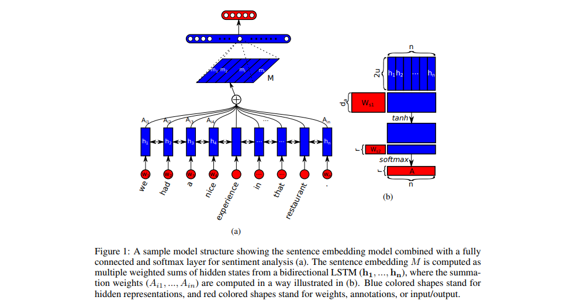

# News Classify based on Self-attention Sentences Embedding

## Basic Structure

This project is based on "[A Structured Self-attentive Sentence Embedding](https://arxiv.org/abs/1703.03130)" (ICLR 2017)

## Information

### Introduction

The focus of this project is on the application of neural networks and self-attention.
I will try to build a combination of the more popular Bidirectional Long Short-term Memory (Bi-LSTM) neural network model 
and the self-attention word embedding structure, and use this model to complete the news classification.

At the same time, I will use the traditional Bayesian classification method to classify and evaluate the dataset and compare the final result with the results of the neural network model to analyze the advantages and disadvantages of the two methods.

### Requirements

* Python3.0
* TensorFlow 1.14
* sklearn

### DataSet

* AG's news topic classification dataset.

### Program File

* preprocess.py
* self-attention_module.py
* NaiveBayes_module.py
* train.py
* eval.py

### Result

